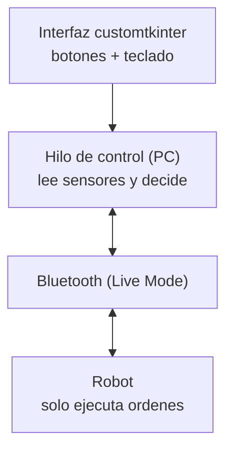
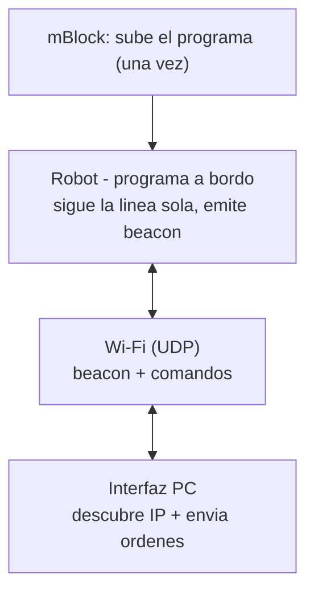
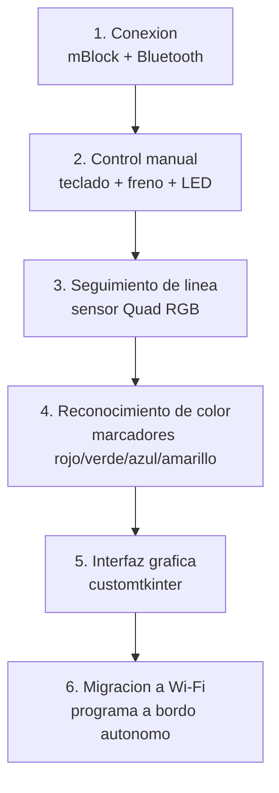
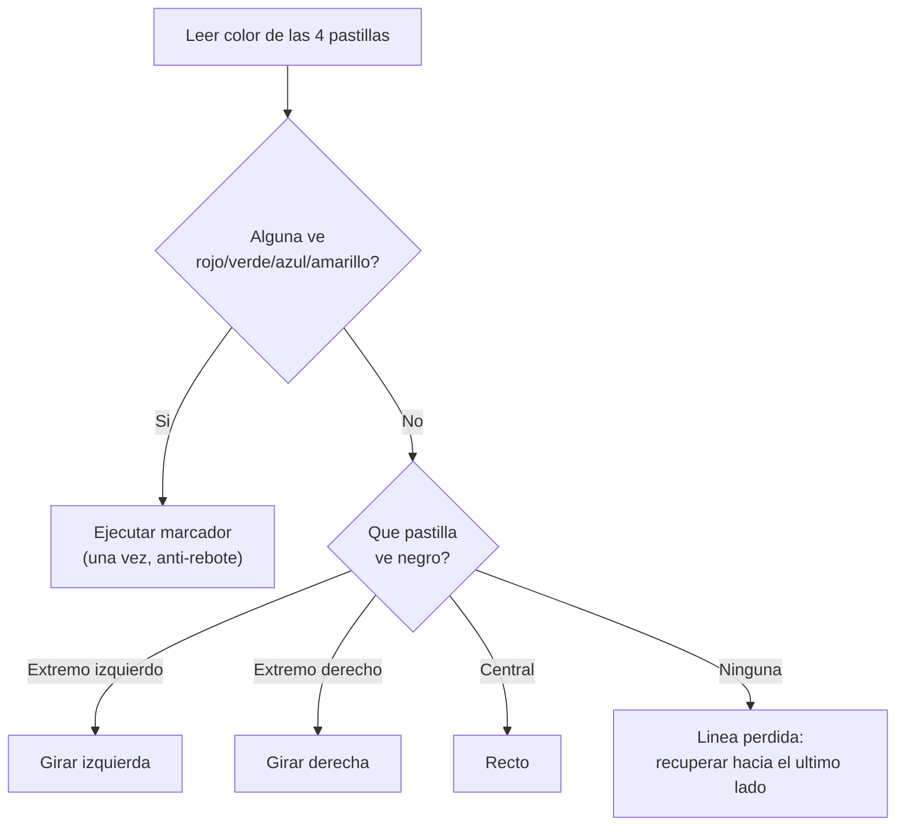

# Robot mBot2 — Control manual y seguimiento de pista

Proyecto de programación de un robot **mBot2** (controlador **CyberPi**) con dos
modos de operación: **manual** (conducción por teclado) y **pista** (seguimiento
de línea con reconocimiento de colores). El desarrollo pasó por dos arquitecturas
—primero por **Bluetooth** y luego por **Wi-Fi**— documentadas más abajo.

---

## Tabla de contenido

1. [Hardware y software](#hardware-y-software)
2. [Arquitecturas del proyecto](#arquitecturas-del-proyecto)
3. [Proceso de desarrollo](#proceso-de-desarrollo)
4. [Estructura de archivos](#estructura-de-archivos)
5. [Instalación y uso](#instalación-y-uso)
6. [Calibración del sensor](#calibración-del-sensor)
7. [Parámetros ajustables](#parámetros-ajustables)
8. [Problemas encontrados y soluciones](#problemas-encontrados-y-soluciones)
9. [Videos de evidencia](#videos-de-evidencia)

---

## Hardware y software

**Hardware**
- Robot **mBot2** con controlador **CyberPi** (pantalla, joystick, botones, Wi-Fi, Bluetooth, giroscopio, micrófono, sensor de luz).
- **Sensor ultrasónico** (distancia) — usado como freno en modo manual.
- **Sensor Quad RGB** (4 pastillas) — usado para seguir la línea y detectar colores.

**Software**
- **mBlock 5** (`ide.mblock.cc` o app de escritorio) para programar y subir código.
- **Python 3** en el PC.
- Librerías del PC: `mbot2` (comunidad, DrorSh, sobre `bleak`) para la versión Bluetooth, y `customtkinter` para la interfaz gráfica.
- MicroPython a bordo del CyberPi (módulos `cyberpi`, `mbot2`, `mbuild`) para la versión Wi-Fi.

---

## Arquitecturas del proyecto

El proyecto tiene **dos versiones** con una diferencia de fondo: **dónde vive la
lógica de control** (el "cerebro").

### Versión Bluetooth — el cerebro en el PC

Todo corre en el PC. El robot solo ejecuta, al instante, las órdenes que le llegan
por Bluetooth (Live Mode). Es sencillo de montar, pero la latencia de la radio
limita el seguimiento de línea, que por eso se hace a velocidad baja.



### Versión Wi-Fi — el cerebro en el robot

El programa se sube una sola vez al robot con mBlock y corre de forma autónoma.
El robot anuncia su IP por un "beacon" y escucha comandos del PC por UDP. La lógica
rápida (seguir la línea) corre dentro del robot, sin latencia de radio.



---

## Proceso de desarrollo

El proyecto se construyó por fases, cada una añadiendo una capacidad sobre la
anterior.



### Fase 1 — Conexión y primeros pasos
Se conectó el mBot2 a mBlock y se estableció el control desde Python en el PC por
Bluetooth (Live Mode), usando la librería `mbot2`. El PC envía comandos y el robot
los ejecuta en tiempo real.

### Fase 2 — Control manual
Conducción con las flechas del teclado (leído con `pynput` y, después, con la
propia ventana). Se añadió:
- **Freno de seguridad** con el sensor ultrasónico (no avanza si hay un obstáculo cerca).
- **Velocidad ajustable** con `+` / `-`.
- **LED por rango de velocidad** (verde lento, ámbar medio, rojo rápido).
- **Registro en CSV** de distancia, velocidad, batería, etc., para análisis posterior.

### Fase 3 — Seguimiento de línea
Con el sensor Quad RGB. La lógica final es **discreta**, pensada para una **línea
delgada**: si una pastilla **central** ve la línea, va recto (zona muerta que evita
el serpenteo); si la línea llega a una pastilla de un **extremo**, gira hacia ese
lado.



### Fase 4 — Reconocimiento de colores
Sobre la línea se colocan **marcadores de color** que disparan acciones. Se usa
`get_color_sta`, que devuelve el color de cada pastilla como texto. Con **anti-rebote**
(actuar una sola vez por marcador):
- **Rojo** → parar / pausar.
- **Verde** → seguir recto (cruzar).
- **Azul** → sonido + avanzar.
- **Amarillo** → sonido + avanzar.

### Fase 5 — Interfaz gráfica
Interfaz de escritorio con **customtkinter**. Arquitectura de hilos: la ventana
corre en el hilo principal y **todo el diálogo con el robot ocurre en un hilo de
trabajo aparte**, para no congelar la interfaz. Los botones solo cambian variables
de estado; el hilo las lee y actúa. La ventana se refresca con `after(...)`.

### Fase 6 — Migración a Wi-Fi
El seguimiento de línea necesita un bucle rápido, y la latencia de Bluetooth lo
limitaba. La solución fue mover el "cerebro" al robot: un único **programa
despachador** a bordo con todas las rutinas como funciones y un bucle que escucha
comandos del PC por **UDP** y ejecuta el modo activo. El robot descubre su IP con
`get_wifi_info()` y la anuncia por **broadcast**; el PC la recibe y la guarda para
enviar los comandos. Incluye un **watchdog** de seguridad (si el PC deja de enviar
en modo manual, el robot para).

---

## Estructura de archivos

| Archivo | Versión | Descripción |
|---|---|---|
| `interfaz_mbot2_colores.py` | Bluetooth | Interfaz completa: manual + pista + colores + CSV + telemetría. Corre en el PC. |
| `conexion_wifi.py` | Wi-Fi | Programa que se **sube al robot** con mBlock. Autónomo: Wi-Fi, beacon de IP, manual y pista. |
| `identificacion_red.py` | Wi-Fi | Interfaz del PC que descubre la IP y envía comandos por UDP. |

---

## Instalación y uso

### Versión Bluetooth
1. Clonar el repositorio Github:
   ```
   git clone https://github.com/DrorSh/mbot_python.git
   ```
2. Instalar la librería del robot (dentro de la carpeta del repo `mbot_python`):
   ```
   pip install -e .
   ```
3. Instalar la interfaz:
   ```
   pip install customtkinter
   ```
4. Encender el mBot2 (sin conectarlo a mBlock ni al móvil) y ejecutar:
   ```
   python scripts_complementarios/interfaz_mbot2_colores.py
   ```
5. Pulsar **Conectar**, elegir **Manual** o **Pista**. La ventana debe tener el
   foco para que las flechas funcionen en manual.

### Versión Wi-Fi
1. Abrir `conexion_wifi.py` en el editor de Python de mBlock, poner el `SSID`
   y `PASSWORD` de la red (2.4 GHz), y **subirlo** al robot (modo Subir).
2. Al arrancar, el robot muestra en pantalla **WiFi OK** y su **IP**. A partir de
   aquí ya se puede cerrar mBlock: el robot corre solo.
3. En el PC:
   ```
   pip install customtkinter
   python pc_control_wifi.py
   ```
   La interfaz **descubre la IP automáticamente** (por el beacon) y la muestra.
4. Elegir **Manual**, **Pista** o **Parar**. En manual se conduce con las flechas.
5. El script cargado el robot es `mbot_script.py`

> El PC y el robot deben estar en la **misma red Wi-Fi**.

---

## Calibración del sensor

El sensor Quad RGB debe calibrarse **una vez** antes de usarlo, desde mBlock:
1. Firmware del CyberPi actualizado y extensión del Quad RGB al día.
2. Colocar el sensor sobre papel blanco, a **12–13 mm** del suelo, con luz de sala
   normal (nada de luz intensa o directa).
3. Ejecutar la rutina de calibración y esperar el mensaje **"Calibration completed"**.
4. Calibrar en el **mismo sitio y con la misma luz** donde se va a rodar.

Para revisar que quedó bien, se lee el color de las 4 pastillas sobre blanco, sobre
la línea negra y sobre cada marcador: los valores deben salir estables y coherentes.
Para este proceso se diseñaron los siguientes scripts:
1. calibrar_colores.py
2. calibrar_pista.py
3. calibrar.py

---

## Problemas encontrados y soluciones

Registro de los obstáculos reales del desarrollo y cómo se resolvieron.

**La función de offset del sensor devolvía `None`.**
En este firmware `get_line_track_offset()` no opera, pero `is_line()` y
`get_color_sta()` sí. Solución: calcular la desviación nosotros a partir del estado
de las 4 pastillas, sin depender del offset.

**El robot no iba recto con potencias iguales.**
Las dos ruedas no giran igual con la misma orden. 

**Serpenteo con la línea delgada.**
El promedio ponderado corregía de más cuando la línea caía en un solo sensor
central. Solución: lógica discreta con **zona muerta** central (recto si un central
la ve; girar solo si llega a un extremo).

**La detección de color se disparaba varias veces por marcador.**
El sensor ve el color durante varias lecturas al cruzarlo. Solución: **anti-rebote**,
actuar una sola vez hasta que el color desaparece.

**Latencia de Bluetooth en el seguimiento de línea.**
El bucle por radio no alcanzaba la frecuencia necesaria. Solución: **migrar a Wi-Fi**
con el bucle corriendo a bordo del robot.

**No existía `get_ip()` en el firmware.**
Se construyó un script para identificación de red `identificacion_red.py`, con el fin
de abrir un socket en espera del envío de datos del robot, y confirmar su dirección
IP de conexión.

**Red institucional con posible aislamiento de clientes.**
Si el PC y el robot no se ven entre sí en una red compartida, la solución es usar
un **hotspot propio** (móvil o router) en 2.4 GHz, donde los dispositivos sí se
comunican.


## Videos de evidencia

| # | Descripción | Enlace |
|---|-------------|--------|
| 1 | Control manual por teclado | [Ver video](https://drive.google.com/file/d/1OgEeFgX3WYS4bRWydCfJB-nVmcozh_Fp/view?usp=drive_link) |
| 2 | Control manual velocidad | [Ver video](https://drive.google.com/file/d/1DriaVQnSpzyJcXTMhfhGbQVvace9USzM/view?usp=drive_link) |
| 3 | Control manual velocidad color sensores | [Ver video](https://drive.google.com/file/d/1Zqc6-bZ9Qd-nID0OzFTyI34SKEI5XrjM/view?usp=drive_link) |
| 4 | Control manual sonidos predeterminados | [Ver video](https://drive.google.com/file/d/1O0RMN9rzfiCaOWu73IqHVHXQ0GupGet1/view?usp=drive_link) |
| 5 | Control manual sonidos notas musicales | [Ver video](https://drive.google.com/file/d/1Nw5NF02zmek_8seJuaNd1PPCoomiq32O/view?usp=drive_link) |
| 5 | Control Pista | [Ver video](https://drive.google.com/file/d/1XRw-TDb99uCfnNNgSq3E4wGPcBWv0eAF/view?usp=drive_link) |