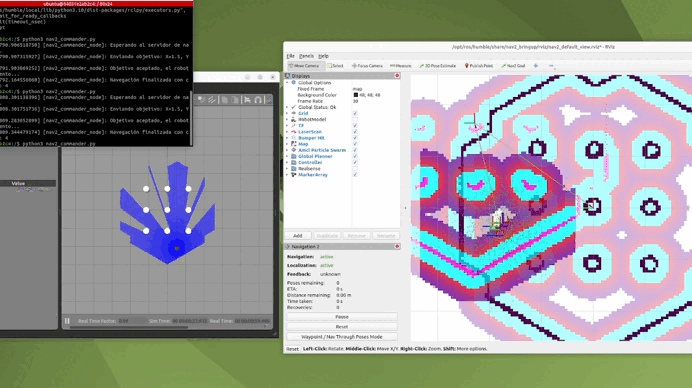

# Navegación Autónoma con ROS 2 Nav2 y TurtleBot3

Simulación de navegación autónoma de un robot móvil **TurtleBot3** utilizando **ROS 2 Humble**, el stack de navegación **Nav2** y **Gazebo**, ejecutado dentro de un contenedor **Docker** con acceso por navegador (noVNC).

El proyecto cubre el flujo completo en dos fases: construcción del mapa mediante **SLAM** y navegación autónoma sobre el mapa previamente guardado, incluyendo el envío de metas de navegación mediante un script en **Python**.

---

## Requisitos previos

- [Docker](https://www.docker.com/) instalado
- Un navegador web (para acceder al escritorio remoto por noVNC)

> **Nota:** en cada terminal nueva dentro del contenedor recuerda cargar el entorno de ROS 2 con `source /opt/ros/humble/setup.bash`. Puedes verificar que todo funciona correctamente abriendo RViz con `rviz2`.

---

## 1. Creación del contenedor Docker

Se utiliza la imagen `ros2-desktop-vnc:humble`, que incluye un escritorio con ROS 2 Humble accesible desde el navegador.

> El siguiente comando está escrito para **PowerShell** (Windows). Las comillas invertidas (`` ` ``) son el carácter de continuación de línea en PowerShell.

```powershell
docker run -d `
  --name ros2_web `
  -p 6080:80 `
  --shm-size=512m `
  ghcr.io/tiryoh/ros2-desktop-vnc:humble
```

Una vez iniciado el contenedor, abre el navegador en:

```
http://localhost:6080
```

---

## 2. Instalación de paquetes

Dentro del contenedor, instala el stack de navegación Nav2 y las herramientas necesarias:

```bash
sudo apt update && sudo apt install -y \
  ros-humble-nav2-bringup \
  ros-humble-nav2-map-server \
  ros-humble-teleop-twist-keyboard \
  ros-humble-nav2-msgs
```

Instala también la simulación de TurtleBot3 en Gazebo:

```bash
sudo apt update && sudo apt install -y \
  ros-humble-turtlebot3-gazebo \
  ros-humble-turtlebot3-simulations
```

---

## 3. Fase 1 — Construcción del mapa (SLAM)

### 3.1 Lanzar la simulación con SLAM

Para construir un mapa desde cero (mapa **no descubierto**), lanza la simulación con SLAM activado:

```bash
ros2 launch nav2_bringup tb3_simulation_launch.py slam:=True
```

> Para cargar un mapa **ya descubierto**, se usa `slam:=False`.

### 3.2 Controlar el robot por teclado

En otra terminal, mueve el robot manualmente para recorrer el entorno mientras se genera el mapa:

```bash
ros2 run teleop_twist_keyboard teleop_twist_keyboard
```

### 3.3 Guardar el mapa

Una vez recorrido el entorno, guarda el mapa generado:

```bash
source /opt/ros/humble/setup.bash
ros2 run nav2_map_server map_saver_cli -f ~/mapa_laboratorio
```

Esto genera los archivos `mapa_laboratorio.yaml` y `mapa_laboratorio.pgm` en tu carpeta de usuario.

---

## 4. Fase 2 — Navegación autónoma

### 4.1 Configurar variables de entorno

Para evitar errores con las variables de entorno de Gazebo dentro de Docker, ejecuta lo siguiente **en la misma terminal** que usarás para el lanzamiento:

```bash
source /usr/share/gazebo/setup.sh
export GAZEBO_MODEL_PATH=/usr/share/gazebo-11/models:/opt/ros/humble/share/turtlebot3_gazebo/models:$GAZEBO_MODEL_PATH
export TURTLEBOT3_MODEL=Burger
```

### 4.2 Lanzar la navegación con el mapa guardado

```bash
ros2 launch nav2_bringup tb3_simulation_launch.py \
  map:=$HOME/mapa_laboratorio.yaml \
  slam:=False \
  z_pose:=0.1 \
  headless:=False
```

### 4.3 Visualizar en Gazebo 3D

Para abrir la interfaz gráfica 3D de Gazebo:

```bash
gzclient
```

### 4.4 Enviar metas con el script de Python

Ejecuta el script `nav2_commander.py` para enviar metas de navegación de forma programática:

```bash
source /opt/ros/humble/setup.bash
python3 nav2_commander.py
```

---

## Solución de problemas

Si la simulación falla al cargar o quedan procesos colgados, puedes forzar su cierre:

```bash
pkill -9 -f ros
pkill -9 -f gz
killall -9 gzserver gzclient
```

---

## Resultados

<!-- Reemplaza esta línea con la URL del video en Drive -->
**Video de la demostración:** [Video drive](https://drive.google.com/file/d/1K-_NN8Z12PnPwWqScyX1goHYd2umqdVt/view?usp=sharing)

Demostración en formato GIF:



---

## Trabajo adicional (modalidad virtual)

Como parte del trabajo complementario realizado en modalidad virtual:

- **Repositorio de simulación:** [my_robot (rama `finished`)](https://github.com/cmoralesd/my_robot/tree/finished)
- **Documento de referencia sobre brazos robóticos en simulación con ROS:** [TFG Pascual González (PDF)](https://jmgandarias.com/teaching/supervision/theses/TFG_Pascual_Gonzalez.pdf)
